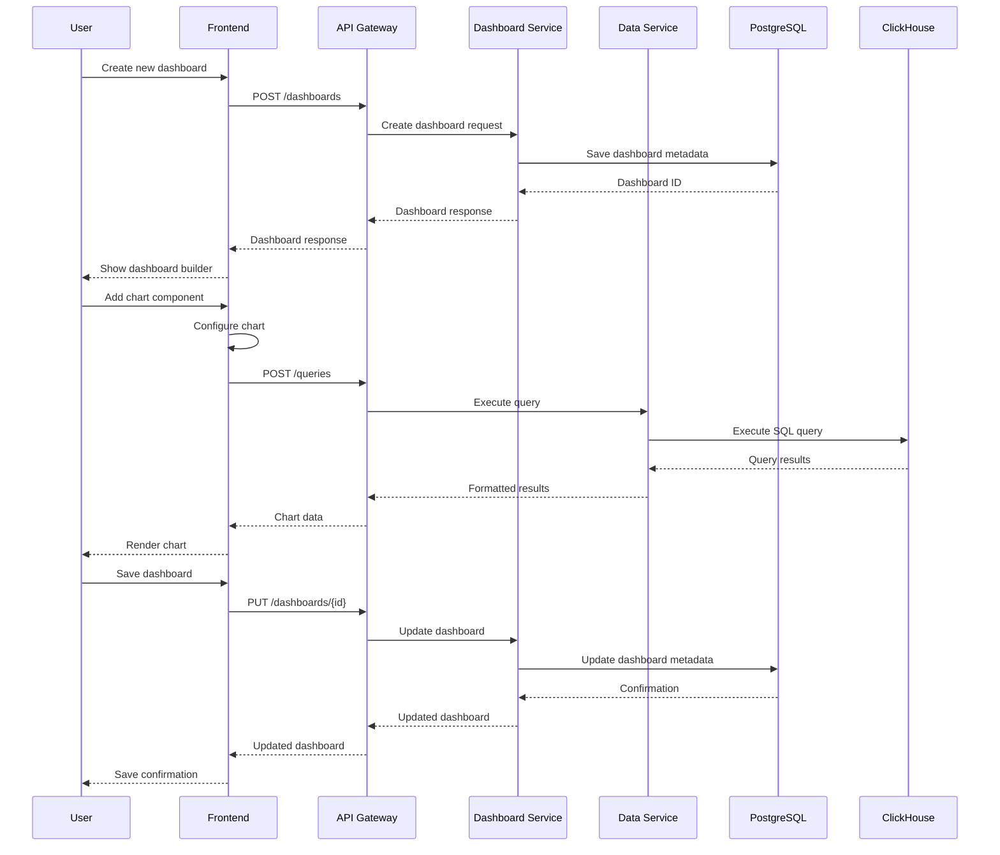
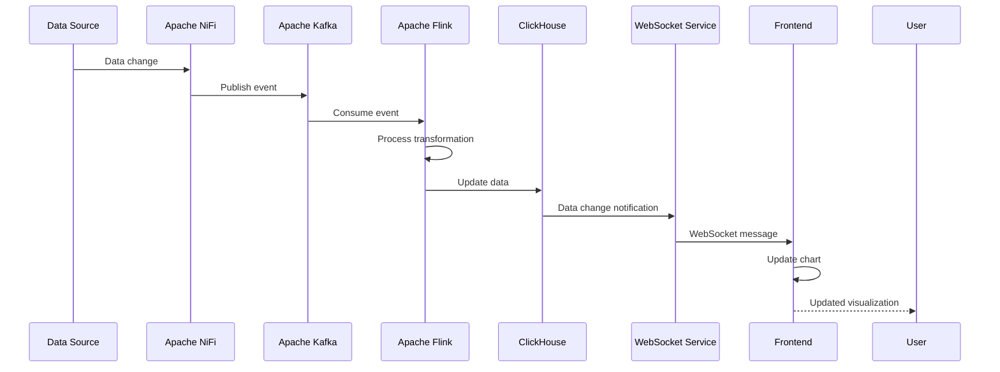

# Core Workflows

### Dashboard Creation Workflow

```mermaid
sequenceDiagram
    participant User
    participant Frontend
    participant API Gateway
    participant Dashboard Service
    participant Data Service
    participant PostgreSQL
    participant ClickHouse

    User->>Frontend: Create new dashboard
    Frontend->>API Gateway: POST /dashboards
    API Gateway->>Dashboard Service: Create dashboard request
    Dashboard Service->>PostgreSQL: Save dashboard metadata
    PostgreSQL-->>Dashboard Service: Dashboard ID
    Dashboard Service-->>API Gateway: Dashboard response
    API Gateway-->>Frontend: Dashboard response
    Frontend-->>User: Show dashboard builder

    User->>Frontend: Add chart component
    Frontend->>Frontend: Configure chart
    Frontend->>API Gateway: POST /queries
    API Gateway->>Data Service: Execute query
    Data Service->>ClickHouse: Execute SQL query
    ClickHouse-->>Data Service: Query results
    Data Service-->>API Gateway: Formatted results
    API Gateway-->>Frontend: Chart data
    Frontend-->>User: Render chart

    User->>Frontend: Save dashboard
    Frontend->>API Gateway: PUT /dashboards/{id}
    API Gateway->>Dashboard Service: Update dashboard
    Dashboard Service->>PostgreSQL: Update dashboard metadata
    PostgreSQL-->>Dashboard Service: Confirmation
    Dashboard Service-->>API Gateway: Updated dashboard
    API Gateway-->>Frontend: Updated dashboard
    Frontend-->>User: Save confirmation
```

### Real-time Data Update Workflow

```mermaid
sequenceDiagram
    participant Data Source
    participant Apache NiFi
    participant Apache Kafka
    participant Apache Flink
    participant ClickHouse
    participant WebSocket Service
    participant Frontend
    participant User

    Data Source->>Apache NiFi: Data change
    Apache NiFi->>Apache Kafka: Publish event
    Apache Kafka->>Apache Flink: Consume event
    Apache Flink->>Apache Flink: Process transformation
    Apache Flink->>ClickHouse: Update data
    ClickHouse->>WebSocket Service: Data change notification
    WebSocket Service->>Frontend: WebSocket message
    Frontend->>Frontend: Update chart
    Frontend-->>User: Updated visualization
```

