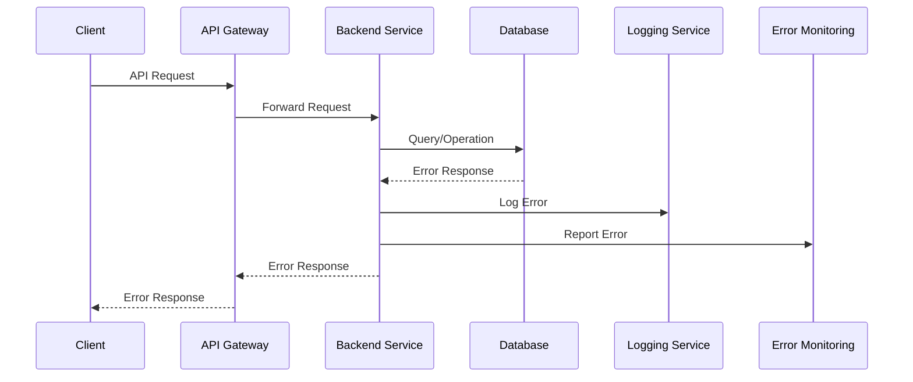

# Error Handling Strategy

### Error Flow



### Error Response Format

```typescript
interface ApiError {
  error: {
    code: string;
    message: string;
    details?: Record<string, any>;
    timestamp: string;
    requestId: string;
    stack?: string; // Only in development
  };
}
```

### Frontend Error Handling

```typescript
// Error boundary component
class ErrorBoundary extends React.Component<
  { children: React.ReactNode },
  { hasError: boolean; error?: Error }
> {
  constructor(props: { children: React.ReactNode }) {
    super(props);
    this.state = { hasError: false };
  }

  static getDerivedStateFromError(error: Error) {
    return { hasError: true, error };
  }

  componentDidCatch(error: Error, errorInfo: React.ErrorInfo) {
    console.error('Error caught by boundary:', error, errorInfo);
    // Report to error monitoring service
    reportError(error, errorInfo);
  }

  render() {
    if (this.state.hasError) {
      return (
        <div className="error-fallback">
          <h2>Something went wrong.</h2>
          <details>
            {this.state.error && this.state.error.message}
          </details>
        </div>
      );
    }

    return this.props.children;
  }
}

// API error handling hook
const useApiError = () => {
  const [error, setError] = useState<ApiError | null>(null);

  const handleError = useCallback((error: unknown) => {
    if (error && typeof error === 'object' && 'response' in error) {
      const apiError = error.response.data as ApiError;
      setError(apiError);
    } else {
      setError({
        error: {
          code: 'UNKNOWN_ERROR',
          message: 'An unexpected error occurred',
          timestamp: new Date().toISOString(),
          requestId: generateRequestId()
        }
      });
    }
  }, []);

  const clearError = useCallback(() => {
    setError(null);
  }, []);

  return { error, handleError, clearError };
};
```

### Backend Error Handling

```typescript
// Error handling middleware
const errorHandler = (
  error: Error,
  req: Request,
  res: Response,
  next: NextFunction
) => {
  const requestId = req.headers['x-request-id'] || generateRequestId();
  
  // Log error
  logger.error('Request error', {
    error: error.message,
    stack: error.stack,
    requestId,
    userId: req.user?.id,
    path: req.path,
    method: req.method
  });

  // Send to error monitoring
  errorMonitoring.captureException(error, {
    requestId,
    user: req.user,
    request: {
      url: req.url,
      method: req.method,
      headers: req.headers,
      body: req.body
    }
  });

  // Return appropriate error response
  if (error instanceof ValidationError) {
    return res.status(400).json({
      error: {
        code: 'VALIDATION_ERROR',
        message: error.message,
        details: error.details,
        timestamp: new Date().toISOString(),
        requestId
      }
    });
  }

  if (error instanceof AuthenticationError) {
    return res.status(401).json({
      error: {
        code: 'AUTHENTICATION_ERROR',
        message: error.message,
        timestamp: new Date().toISOString(),
        requestId
      }
    });
  }

  if (error instanceof AuthorizationError) {
    return res.status(403).json({
      error: {
        code: 'AUTHORIZATION_ERROR',
        message: error.message,
        timestamp: new Date().toISOString(),
        requestId
      }
    });
  }

  // Default error response
  res.status(500).json({
    error: {
      code: 'INTERNAL_SERVER_ERROR',
      message: process.env.NODE_ENV === 'production' 
        ? 'An unexpected error occurred' 
        : error.message,
      timestamp: new Date().toISOString(),
      requestId,
      ...(process.env.NODE_ENV !== 'production' && { stack: error.stack })
    }
  });
};

// Custom error classes
class ValidationError extends Error {
  constructor(message: string, public details?: Record<string, any>) {
    super(message);
    this.name = 'ValidationError';
  }
}

class AuthenticationError extends Error {
  constructor(message: string) {
    super(message);
    this.name = 'AuthenticationError';
  }
}

class AuthorizationError extends Error {
  constructor(message: string) {
    super(message);
    this.name = 'AuthorizationError';
  }
}
```

