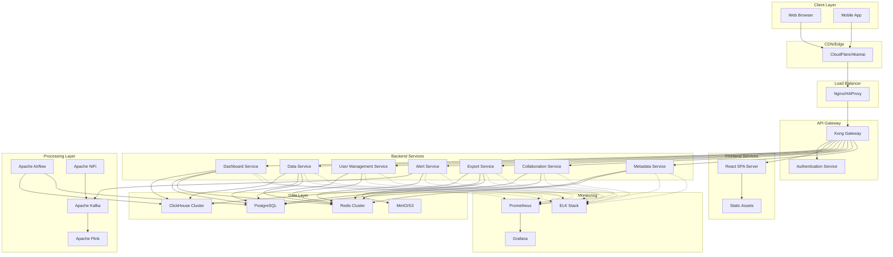

# High Level Architecture

### Technical Summary

The system is designed as a cloud-native, microservices-based architecture leveraging ClickHouse for high-performance analytics, PostgreSQL for metadata management, and React for the frontend. The architecture supports real-time data streaming via Kafka, batch processing via Airflow, and scales horizontally using Kubernetes orchestration. The platform is designed to handle 10,000+ concurrent users with sub-second query performance on billion-row datasets while maintaining complete open-source compliance and vendor neutrality.

### Platform and Infrastructure Choice

**Platform:** Cloud-native with Kubernetes-first approach
**Key Services:** AWS EKS/GKE/AKS, RDS PostgreSQL, Managed Redis, S3/MinIO storage
**Deployment Host and Regions:** Multi-region deployment with auto-scaling groups

### Repository Structure

**Structure:** Monorepo with npm workspaces
**Monorepo Tool:** Nx or Lerna for dependency management
**Package Organization:** Separated by domain (frontend, backend, shared)

### Architecture Diagram

### Architectural Patterns

- **Microservices Architecture**: Domain-driven service separation with independent scaling
- **Event-Driven Architecture**: Kafka-based asynchronous communication between services
- **CQRS Pattern**: Command Query Responsibility Segregation for data operations
- **API Gateway Pattern**: Centralized entry point with routing and authentication
- **Database-per-Service Pattern**: Each service owns its data with appropriate databases
- **Circuit Breaker Pattern**: Resilience for external service calls
- **Saga Pattern**: Distributed transaction management across services

