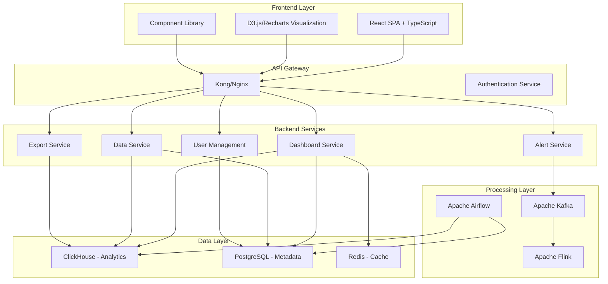

# 📊 Mary - Business Analyst - Document Generation

I'll now generate a comprehensive markdown document with all the details we've discussed for your open-source BI application plan.

# Open-Source Business Intelligence Application Development Plan

## Executive Summary

This document outlines a comprehensive plan for developing a Qlik/Tableau-like Business Intelligence (BI) application using only open-source technologies. The solution covers all essential BI functionalities including data ingestion, ETL pipelines, interactive dashboards, visualization libraries, security, and collaboration features, while maintaining vendor neutrality and full open-source compliance.

## 1. Data Ingestion & ETL Pipelines

### Recommended Technologies
- **Apache NiFi** - Visual data flow design, 150+ processors for various sources
- **Apache Airflow** - Workflow orchestration and scheduling
- **Apache Kafka** - Real-time data streaming
- **Apache Flink** - Stream processing and transformations
- **Debezium** - CDC (Change Data Capture) for real-time database changes
- **Pandas/Polars** - Data transformation in Python services

### Architecture
```
Sources → NiFi → Kafka → Flink → ClickHouse
         ↓
      Airflow → Batch Jobs → PostgreSQL Metadata
```

### Key Features
- **Multi-source connectivity**: 50+ database connectors, REST APIs, file formats
- **Schema evolution handling**: Automatic detection and versioning
- **Data quality validation**: Built-in validation rules and anomaly detection
- **Incremental loads**: CDC and watermark-based incremental processing

## 2. Data Modeling & Storage Strategy

### Recommended Technologies
- **ClickHouse** - Primary analytical database (columnar storage)
- **PostgreSQL** - Metadata, user data, configuration
- **Apache Druid** - Time-series data and real-time analytics
- **Redis** - Caching and session management
- **MinIO** - Object storage for large files and exports

### Data Modeling Approach
- **Star Schema** for traditional BI queries
- **Wide Tables** for ClickHouse optimization
- **Materialized Views** for pre-aggregated metrics
- **Data Vault** methodology for audit trails

### Storage Strategy
```
ClickHouse:
- Fact tables: 1-3 billion rows per table
- Dimension tables: 10M-100M rows
- Compression: 10:1 typical ratio

PostgreSQL:
- User management: <1M users
- Dashboard metadata: <100K dashboards
- Configuration data: <10GB total
```

## 3. Interactive Dashboards & Visualization

### Recommended Technologies
- **React + TypeScript** - Core framework
- **D3.js** - Custom visualizations and advanced charts
- **Recharts** - Standard charts (bar, line, pie, scatter)
- **Apache ECharts** - Complex visualizations (heatmaps, treemaps)
- **Plotly.js** - Statistical and scientific charts
- **Deck.gl** - Geographic and 3D visualizations

### Dashboard Architecture
```
Component Library:
- Chart Components (20+ types)
- Filter Components (date, multi-select, search)
- Layout Components (grid, tabs, accordions)
- Export Components (PDF, Excel, PNG)

Rendering Engine:
- WebGL for large datasets (>100K points)
- Canvas for medium datasets (1K-100K points)
- SVG for small datasets (<1K points)
```

### Key Features
- **50+ chart types** including custom visualizations
- **Cross-filtering** with sub-second response
- **Drill-down** with breadcrumb navigation
- **Responsive design** for mobile/tablet/desktop
- **Real-time updates** via WebSocket connections

## 4. Security & Role-Based Access Control

### Recommended Technologies
- **Keycloak** - Identity and access management
- **JWT tokens** - Authentication and session management
- **Apache Ranger** - Fine-grained data access control
- **Open Policy Agent (OPA)** - Policy engine for complex rules
- **TLS 1.3** - Encryption in transit
- **Field-level encryption** - Sensitive data protection

### Security Architecture
```
Authentication Flow:
User → Keycloak → JWT → API Gateway → Services

Authorization Layers:
1. Dashboard-level access (view/edit/share)
2. Data-source level access (read/write)
3. Row-level security (data filtering)
4. Column-level masking (PII protection)
```

### Access Control Model
- **5 user roles**: Viewer, Analyst, Designer, Admin, Super Admin
- **Data-level security**: Row-level filtering based on user attributes
- **Resource permissions**: Granular control over dashboards, data sources
- **Audit logging**: Complete audit trail of all data access

## 5. Metadata Management

### Recommended Technologies
- **Apache Atlas** - Data catalog and metadata management
- **OpenMetadata** - Modern metadata platform
- **Custom metadata service** - Business glossary and lineage
- **GraphQL** - Metadata API for flexible queries

### Metadata Architecture
```
Metadata Types:
- Data Source Catalog: Connection details, schemas, tables
- Business Glossary: Terms, definitions, relationships
- Data Lineage: Source-to-target transformations
- Dashboard Metadata: Components, filters, permissions
- Usage Analytics: Popular dashboards, query patterns
```

### Key Features
- **Automated metadata extraction** from data sources
- **Data lineage visualization** showing data flow
- **Business glossary** with search and tagging
- **Impact analysis** for schema changes
- **Data quality metrics** and monitoring

## 6. Collaboration Features

### Recommended Technologies
- **WebSocket** - Real-time collaboration
- **Operational Transform (OT)** - Conflict resolution for concurrent editing
- **WebRTC** - Screen sharing and video calls
- **Commenting System** - Threaded discussions on dashboards
- **Notification Service** - Email and in-app notifications

### Collaboration Architecture
```
Real-time Features:
- Multi-user dashboard editing
- Live cursor tracking
- Comment threads with @mentions
- Shared sessions with screen sharing

Asynchronous Features:
- Dashboard sharing via links
- Subscription to updates
- Version history and rollback
- Approval workflows
```

## 7. Export & Sharing Options

### Recommended Technologies
- **Puppeteer** - PDF generation from dashboards
- **ExcelJS** - Excel file creation
- **CSV generation** - Custom streaming implementation
- **Amazon S3/MinIO** - File storage and CDN
- **Signed URLs** - Secure file sharing

### Export Capabilities
```
Export Formats:
- PDF: High-quality dashboard exports
- Excel: Data tables with formatting
- CSV: Raw data downloads
- PNG: Individual chart images
- JSON: Dashboard configuration

Sharing Methods:
- Public links with expiration
- Embed codes for websites
- Email subscriptions
- API access for programmatic sharing
```

## 8. Scheduling & Alerts

### Recommended Technologies
- **Apache Airflow** - Workflow scheduling
- **Apache Kafka** - Event streaming for alerts
- **WebSocket** - Real-time alert delivery
- **Email service** (Postfix/SendGrid alternative)
- **Slack/Mattermost integration** - Team notifications

### Alert System Architecture
```
Alert Types:
- Data threshold alerts
- Dashboard performance alerts
- Data quality alerts
- System health alerts

Delivery Channels:
- In-app notifications
- Email alerts
- Slack/Teams integration
- Webhook callbacks
```

## 9. Real-time Streaming Support

### Recommended Technologies
- **Apache Kafka** - Distributed streaming platform
- **Apache Flink** - Stream processing engine
- **WebSocket** - Real-time dashboard updates
- **Redis Streams** - Lightweight streaming
- **Materialize** - Real-time materialized views

### Streaming Architecture
```
Real-time Pipeline:
Source → Kafka → Flink → ClickHouse → WebSocket → Dashboard

Update Strategies:
- Push updates (<1 second latency)
- Polling updates (5-30 seconds)
- Hybrid approach (critical data push, rest poll)
```

## 10. Multi-Database Connectivity

### Recommended Technologies
- **JDBC/ODBC drivers** - Standard database connectivity
- **Custom connectors** - NoSQL and API sources
- **Apache Calcite** - SQL parser and optimizer
- **Connection pooling** (HikariCP) - Performance optimization

### Supported Data Sources
```
Databases (30+):
- Relational: PostgreSQL, MySQL, Oracle, SQL Server
- Analytical: ClickHouse, Druid, Snowflake, BigQuery
- NoSQL: MongoDB, Cassandra, Elasticsearch
- File formats: CSV, JSON, Parquet, Avro

APIs & Streaming:
- REST APIs with OAuth2
- GraphQL endpoints
- Kafka topics
- Webhook sources
```

## 11. Extensibility via Plugins

### Recommended Technologies
- **Plugin architecture** based on OSGi or custom module system
- **JavaScript/TypeScript SDK** - Frontend plugin development
- **Java/Python SDK** - Backend plugin development
- **Docker containers** - Plugin isolation and deployment
- **Plugin registry** - Centralized plugin management

### Plugin Categories
```
Plugin Types:
- Data Source Connectors (20+ planned)
- Visualization Components (custom charts)
- Data Transformations (custom functions)
- Authentication Providers (SSO integrations)
- Export Formats (additional file types)
- Themes and Styling (custom branding)
```

## 12. Scalability Considerations

### Horizontal Scaling Strategy
```
Frontend:
- Load balancer → Multiple web servers
- CDN for static assets
- Progressive web app features

Backend:
- Microservices with independent scaling
- Database sharding for large datasets
- Caching layers at multiple levels

Data Layer:
- ClickHouse cluster (replication + sharding)
- Read replicas for PostgreSQL
- Redis cluster for caching
```

### Performance Targets
- **Dashboard load**: <2 seconds for 90% of dashboards
- **Query response**: <5 seconds for 1B row tables
- **Concurrent users**: 10,000+ simultaneous users
- **Data volume**: 10TB+ per workspace

## 13. Security & Deployment

### Security Measures
```
Infrastructure Security:
- Network segmentation (VPC/VLAN)
- Firewall rules and intrusion detection
- DDoS protection
- Regular security scanning

Application Security:
- OWASP Top 10 compliance
- Regular dependency updates
- Penetration testing
- Security headers and CSP
```

### Deployment Options
```
Cloud Deployment:
- Kubernetes cluster (AWS EKS, GKE, AKS)
- Managed services (RDS, ElastiCache)
- Auto-scaling groups
- Monitoring and logging (Prometheus, Grafana)

On-Premises:
- Kubernetes on bare metal
- Private cloud integration
- Air-gapped deployment option
- Local authentication providers
```

## 14. Development Roadmap

### Phase 1: MVP (3-4 months)
```
Core Features:
- Basic dashboard creation (5 chart types)
- Single data source connectivity (PostgreSQL)
- User authentication and basic roles
- Simple export (PDF, CSV)
- Basic sharing functionality

Technical Foundation:
- React frontend with TypeScript
- Node.js backend services
- ClickHouse for analytics
- PostgreSQL for metadata
- Docker deployment
```

### Phase 2: Enhanced Analytics (2-3 months)
```
Advanced Features:
- 20+ chart types with D3.js
- Multi-database connectivity (10+ sources)
- Real-time dashboard updates
- Advanced filtering and cross-filtering
- Data quality monitoring

Infrastructure:
- Kubernetes deployment
- Redis caching layer
- Basic monitoring and logging
- API documentation
```

### Phase 3: Enterprise Features (3-4 months)
```
Enterprise Capabilities:
- Role-based access control (5+ roles)
- Data lineage and metadata management
- Collaboration features (comments, sharing)
- Advanced scheduling and alerts
- Plugin system foundation

Scalability:
- Horizontal scaling support
- Performance optimization
- Security hardening
- Backup and disaster recovery
```

### Phase 4: Advanced Analytics (2-3 months)
```
Advanced Analytics:
- Machine learning integration
- Predictive analytics
- Advanced statistical functions
- Custom visualization builder
- API-first development

Ecosystem:
- Plugin marketplace
- Third-party integrations
- Advanced export options
- Mobile app development
```

### Phase 5: Production Readiness (1-2 months)
```
Production Features:
- Multi-tenant architecture
- Advanced security features
- Compliance certifications (GDPR, SOC2)
- Enterprise SSO integration
- Comprehensive monitoring

Support:
- Documentation portal
- Training materials
- Community forums
- Enterprise support options
```

## 15. Technology Stack Summary

### Frontend Stack
- **Framework**: React 18 + TypeScript
- **State Management**: Redux Toolkit + RTK Query
- **Visualization**: D3.js, Recharts, Apache ECharts
- **UI Library**: Material-UI or Ant Design
- **Build Tool**: Vite
- **Testing**: Jest + React Testing Library

### Backend Stack
- **Runtime**: Node.js 18+ or Java 17+
- **Framework**: Express.js or Spring Boot
- **API**: REST + GraphQL
- **Authentication**: JWT + OAuth2
- **Documentation**: OpenAPI 3.0

### Data & Analytics
- **Analytics DB**: ClickHouse
- **Metadata DB**: PostgreSQL
- **Cache**: Redis
- **Streaming**: Apache Kafka + Flink
- **ETL**: Apache Airflow + NiFi

### Infrastructure
- **Containerization**: Docker
- **Orchestration**: Kubernetes
- **Monitoring**: Prometheus + Grafana
- **Logging**: ELK Stack
- **CI/CD**: GitLab CI or GitHub Actions

## 16. Open Source Compliance

### License Strategy
All recommended technologies use permissive open-source licenses:
- **MIT/Apache 2.0**: Most components
- **BSD**: PostgreSQL, Redis
- **LGPL**: Some visualization libraries
- **No GPL dependencies**: Avoids licensing complications

### Vendor Neutrality
- Cloud-agnostic deployment options
- Multiple database support
- Pluggable authentication providers
- Export to standard formats
- API-first architecture

## 17. Architectural Overview

### Complete System Architecture



## 18. Conclusion

This comprehensive plan provides a solid foundation for building a competitive open-source BI application that can rival commercial solutions like Tableau and Qlik while maintaining full open-source compliance and vendor neutrality. The phased development approach ensures a manageable path from MVP to production-ready enterprise solution.

The recommended technology stack balances performance, scalability, and maintainability while leveraging the best open-source tools available. The architecture supports both cloud and on-premises deployments, ensuring flexibility for different organizational requirements.

---

*Document created using the BMAD-METHOD™ brainstorming framework*